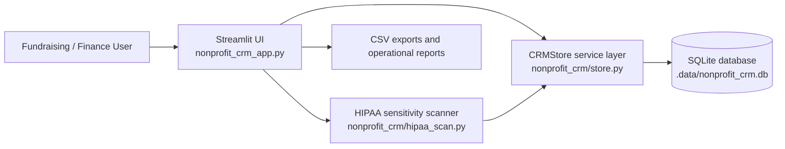
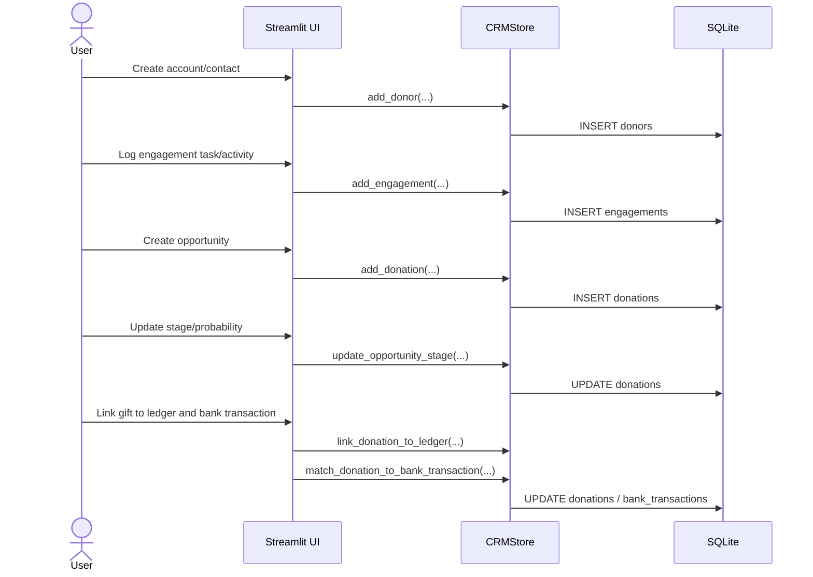
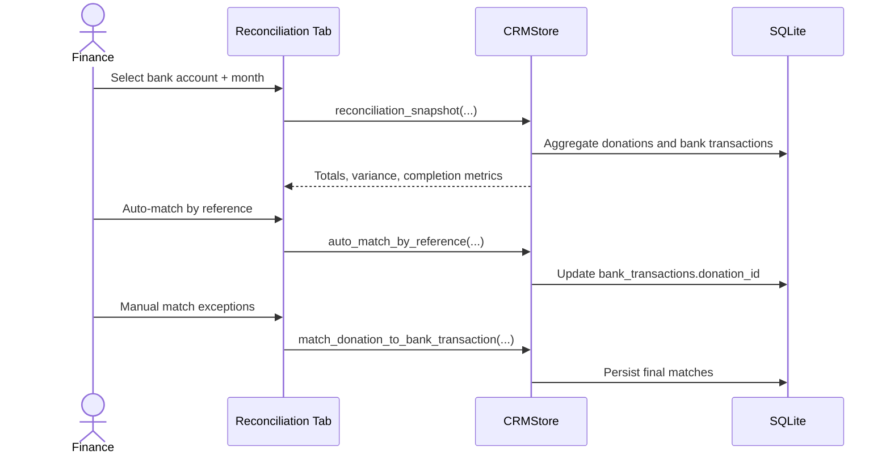
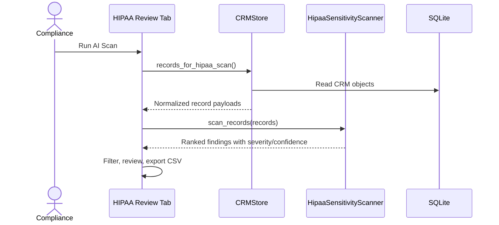

# CRM Architecture and Runtime Flow

This document explains how the nonprofit CRM works end to end.

## High-level architecture

The CRM is a Streamlit application backed by a SQLite persistence layer and optional AI-assisted compliance review.

## Core business flows

### Relationship and gift lifecycle

### Monthly reconciliation

### HIPAA-sensitive data review

## Module responsibilities

- `nonprofit_crm_app.py`: CRM user interface, tab workflows, and report rendering.
- `nonprofit_crm/store.py`: schema management, data access, reconciliation logic, and operational calculations.
- `nonprofit_crm/hipaa_scan.py`: heuristic AI-assisted sensitive-data detection and finding scoring.
- `nonprofit_crm/__init__.py`: package exports for app and tests.

## Data model overview

Primary tables managed by `CRMStore`:

- `donors`: accounts/contacts and relationship owner metadata.
- `engagements`: stewardship activity history and follow-up tasks.
- `donations`: opportunity/gift records, stage, probability, fund/campaign fields.
- `campaigns`: fundraising initiatives, hierarchy, and rollup attribution.
- `ledger_entries`: accounting-side posting records.
- `bank_accounts`: financial account catalog.
- `bank_transactions`: imported/entered bank movement used for reconciliation.

## Runtime state

The app keeps lightweight UI state in `st.session_state`, including:

- search panel state,
- HIPAA scan results and scan timestamp,
- form selections and filter values.

Source-of-truth business data remains in SQLite.

## Known limitations

- Authentication and role-based access control are not yet built in.
- SQLite is suitable for local/small-team usage; production should use managed relational infrastructure.
- HIPAA review findings are heuristic and require human compliance review.

## Extension points

- Add SSO, RBAC, and immutable audit trails.
- Move persistence to PostgreSQL or another managed database.
- Add background jobs for imports and monthly reconciliation automation.
- Expand HIPAA scanner rules and include policy-driven custom detectors.
